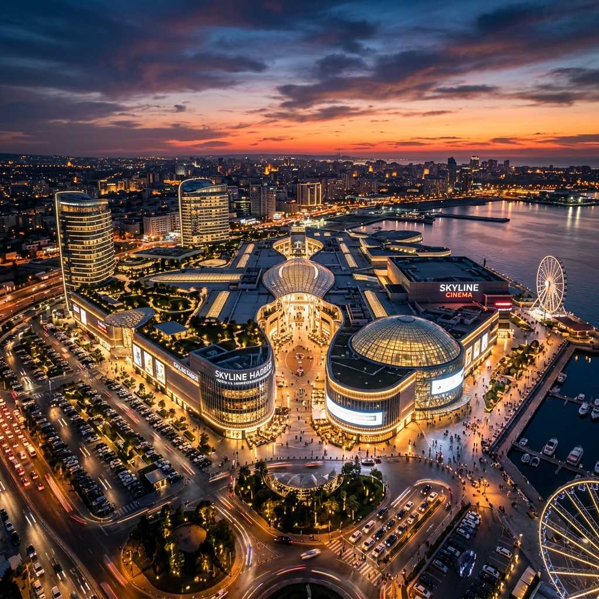

# DREAM STATE | Interactive Sales Deck



An immersive, multi-page interactive sales deck for the **American Dream Mall**. Designed to convert retail brands, luxury flagships, dining operators, and event sponsors by leveraging cinematic storytelling, high-end design, and performant frontend architecture.

---

## 🎯 The Objective

This project was built to demonstrate a sharp artistic eye for interactive design paired with rigorous frontend engineering. The goal was to take heavy property data and transform it into an editorial, premium digital experience.

**Key Evaluation Areas Addressed:**
- **Design Judgment:** Crafted a "dark luxury" aesthetic replacing standard corporate templates with an ultra-premium visual language.
- **Frontend Execution:** Built a modular, zero-build-step vanilla architecture focusing on maintainability and speed.
- **Product Thinking & Storytelling:** Architected a non-linear narrative that guides users from emotional hook to targeted lead-generation paths.
- **AI Integration:** Leveraged AI to art-direct and generate 10 hyper-realistic, 4K visual assets tailored to the brand aesthetic.
- **Performance:** Achieved lightning-fast Time-To-Interactive (TTI) by avoiding bloated JavaScript frameworks and relying on native browser APIs.

---

## 🎨 Visual Design System

The visual language communicates scale, luxury, and exclusivity.

* **Color Palette:** Near-black backgrounds (`#0A0A0B`) provide endless depth, while Champagne Gold (`#C9A84C`) acts as the primary accent for typography and interaction states.
* **Typography:** An elegant, editorial pairing. 
  * **Headlines:** `Cormorant Garamond` (Sophisticated, high-end editorial feel)
  * **Body:** `DM Sans` (Clean, highly legible modern geometric sans-serif)
* **UI Elements:** Subtle frosted glassmorphism (`backdrop-filter: blur`), 1px gold hairlines, and generous whitespace.

---

## 🏗️ Technical Architecture

Built completely dependency-free (no React, Vue, or Webpack) to maximize performance and deployment flexibility. 

### File Structure
```text
dreamstate/
├── index.html                  # Hero / Landing / Video Hook
├── pages/                      # 6 Content Modules + 1 Contact Flow
│   ├── property.html           # Scale & Demographics
│   ├── retail.html             # Leasing Tiers & Categories
│   ├── luxury.html             # High-end Editorial Layout
│   ├── dining.html             # F&B Mosaic & Dwell Time Data
│   ├── entertainment.html      # The Main Differentiators
│   ├── events.html             # Venue Directory
│   └── contact.html            # 3-Path Lead Generation
├── assets/
│   ├── css/
│   │   ├── base.css            # CSS Variables, Typography, Grid utilities
│   │   ├── nav.css             # Persistent Header & Mobile Overlay
│   │   └── animations.css      # IntersectionObserver reveal classes
│   ├── js/
│   │   ├── nav.js              # SPA-like Page Transitions & Mobile logic
│   │   ├── animations.js       # Native IntersectionObserver triggers
│   │   └── counters.js         # 60fps RequestAnimationFrame stat counters
│   └── images/                 # AI-Generated 4K Assets
```

### Core Engineering Decisions

1. **SPA-Like Page Transitions (`nav.js`)**
   A vanilla JS router interceptor prevents hard page loads. When a user clicks a nav link, the DOM fades to an overlay mask, the browser routes to the next HTML file, and the mask fades out—resulting in the smooth feel of a Single Page Application without the massive JS bundle.
   
2. **Hardware-Accelerated Reveals (`animations.js`)**
   Instead of expensive `onScroll` event listeners, the project utilizes the native `IntersectionObserver` API. Elements are revealed using `transform: translateY` and `opacity`, keeping all animation work on the GPU composite layer for a locked 60 FPS experience.

3. **CSS Variables & Utility Classes (`base.css`)**
   Theming is strictly controlled at the `:root` level. A lightweight, custom CSS grid/flex system (`.grid-2`, `.grid-3`, `.flex-center`) keeps the HTML semantic and DRY, eliminating the need for Tailwind while maintaining rapid layout capabilities.

4. **Dynamic Stat Counters (`counters.js`)**
   Performance metrics and visitor data animate natively using `requestAnimationFrame`, smoothly counting up from zero to their target values as they enter the viewport.

---

## 🤖 AI Integration & Asset Generation

Rather than using generic stock photography, the visual narrative was heavily supported by AI-generated imagery. **10 unique 4K assets** were art-directed via prompt engineering to perfectly match the dark luxury aesthetic:
- *Sleek dark-mode SVG-style map visualizations*
- *Moody, Michelin-star level culinary close-ups*
- *Epic indoor concert venue scale representations*
- *Hyper-realistic retail and luxury corridor architectural renders*

---

## 🚀 Deployment

The project requires zero build steps and is ready to be hosted statically on GitHub Pages, Vercel, or Netlify.

1. Clone the repository
2. Open `index.html` in your browser
3. (Optional) Run any local server (e.g. `npx serve`)

---

*Designed and engineered for the ultimate experiential retail platform.*
